# Bachelor's thesis project

### This repository holds the modified application I used while working on my Bachelor's thesis. Below you can find documentation about the features the application provides, and instructions on how to get the app running on your own Android smartphone.

### Link to my Bachelor's thesis will be added [here](https://trepo.tuni.fi/).


---

## Feature Documentation

The table below showcases the different features provided by the modified application.

|             Feature             |                                                                                                                   Description                                                                                                                    |                                            Image                                             |
| :-----------------------------: | :----------------------------------------------------------------------------------------------------------------------------------------------------------------------------------------------------------------------------------------------: | :------------------------------------------------------------------------------------------: |
|            Home View            |                  Different location data. Main Menu button as well Recording ON/OFF button and indicator. Stats about the collected samples and sets. Button for changing to the Map View. Switch for turning geometry ON/OFF.                   |                  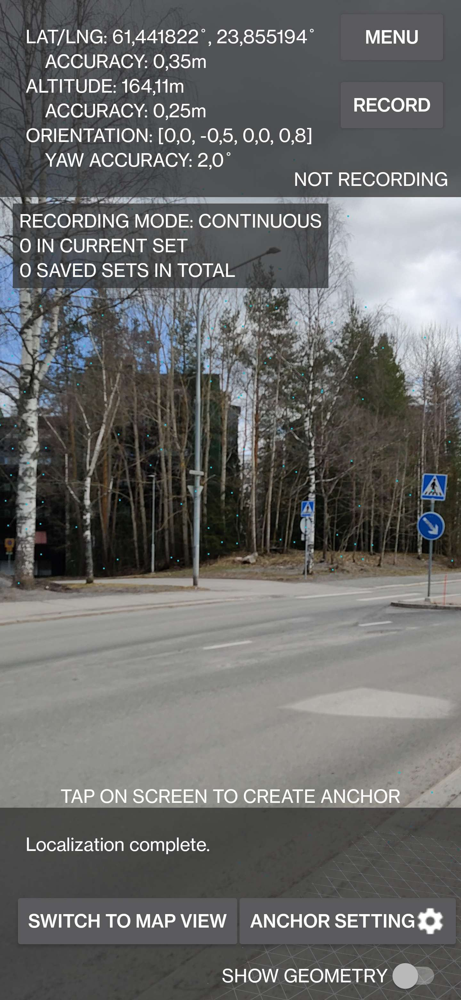                  |
| Home View with Geometry Enabled |                                                 Geometry set ON. Visualizes the surrounding buildings and other structures when horizontal accuracy (topmost accuracy value) is below 10 meters.                                                 |  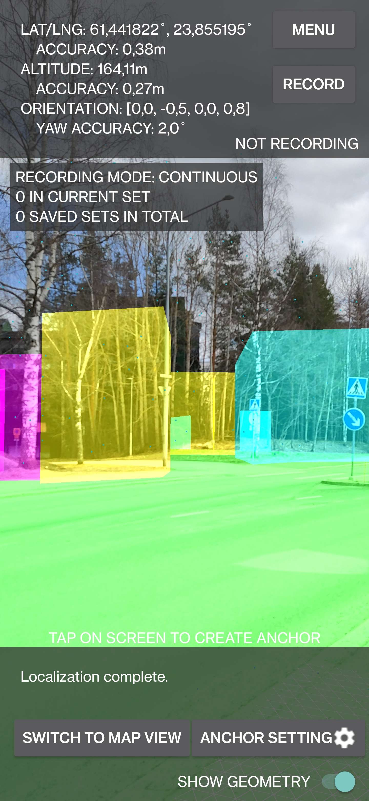   |
|            Main Menu            |                                                      Adjust recording mode as well as collected and saved sets. Export the saved location data in a CSV file. Show the user privacy notice.                                                      |                  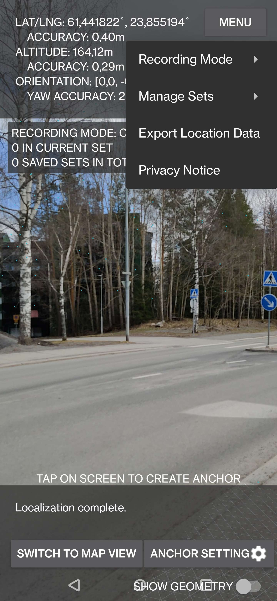                  |
|    Available Recording Modes    | Select between two available modes: single and continuous. Single mode saves a location data sample when the Record button is pressed. In continuous mode, a sample is saved after and until the Record button is pressed in 5-second intervals. |  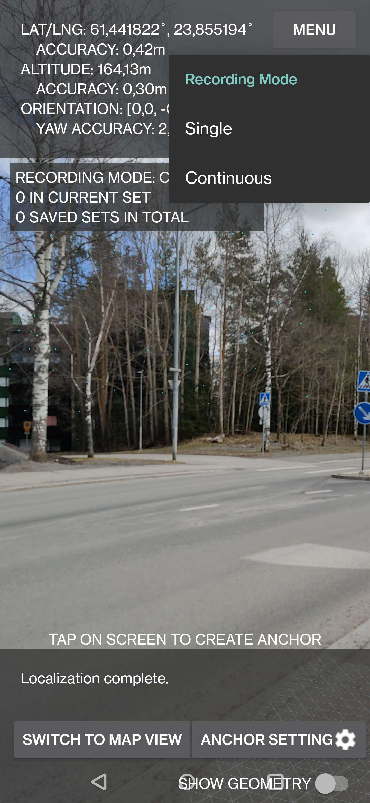   |
|           Manage Sets           |                                                                       Save current set. Create a new set and save the current one (if contains any samples). Clear set(s).                                                                       |           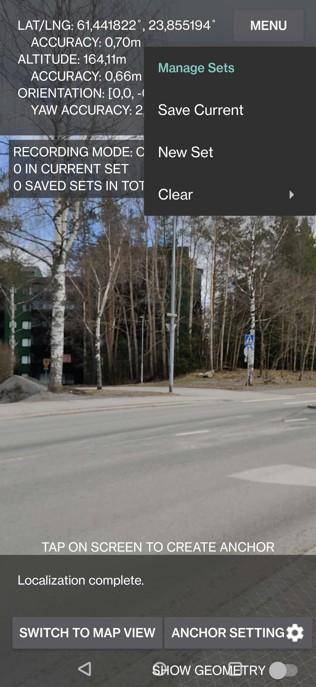           |
|           Clear Sets            |                                                                                          Clear the samples in the current set or in all collected sets.                                                                                          |            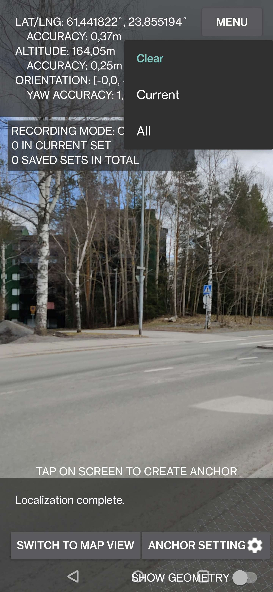            |
|          Recording ON           |                                                                               Text in recording indicator is red. Information about the collected set(s) is shown.                                                                               |            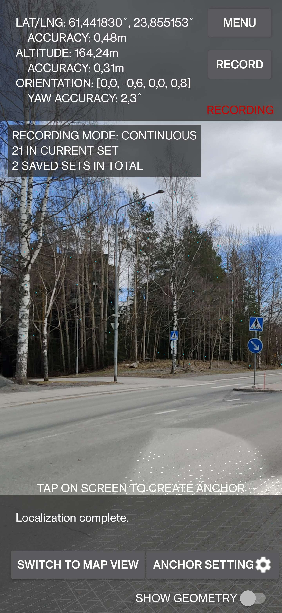             |
|            Map View             |                                             Center map on Tampere, Finland (if no saved samples exist). Plot collected location data on map with markers. Menu (three dots) on the top right corner.                                             |                   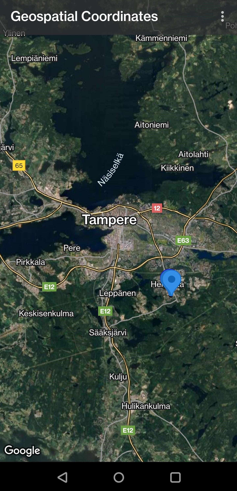                   |
|            Map Menu             |                                                                            Manage visibility of the plotted sets of location data samples. Change type of map layer.                                                                             |                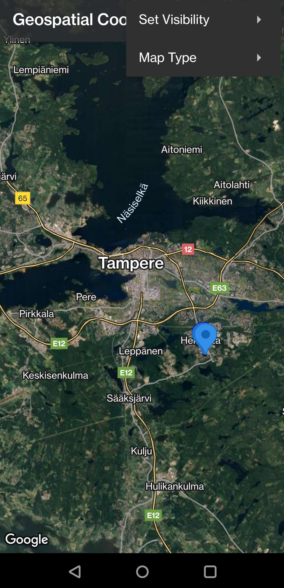                 |
|       Visibility Options        |                                                                                               Manage the visibility of Markers belonging to a set.                                                                                               |    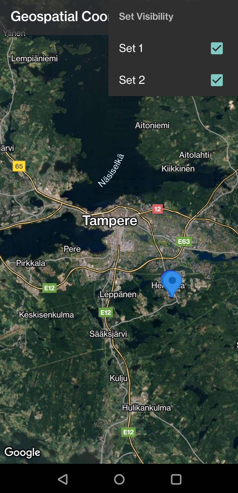     |
|       Available Map Types       |                                                                                     Change the map type between normal, satellite, terrain and hybrid modes.                                                                                     |        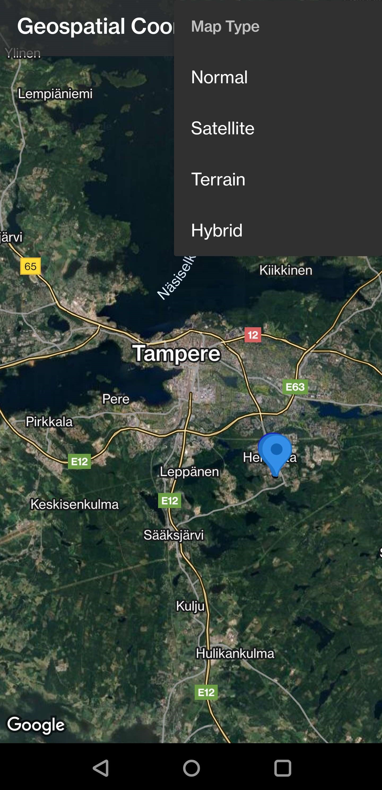         |
| Collected Location Data on Map  |                                                                                               Inspect collected location data samples on the map.                                                                                                |    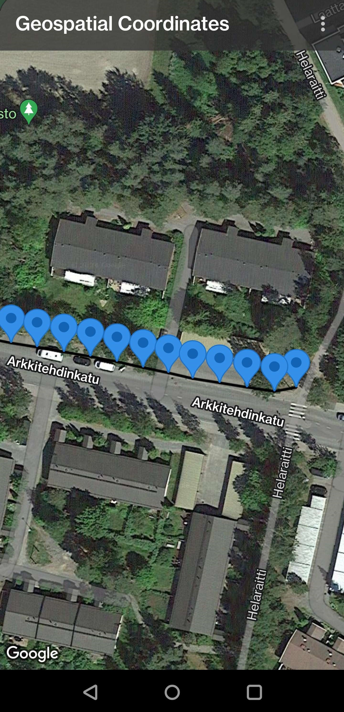    |
| Information Related to a Marker |                                                                              Show the data belonging to a specific sample by pressing on the corresponding Marker.                                                                               | 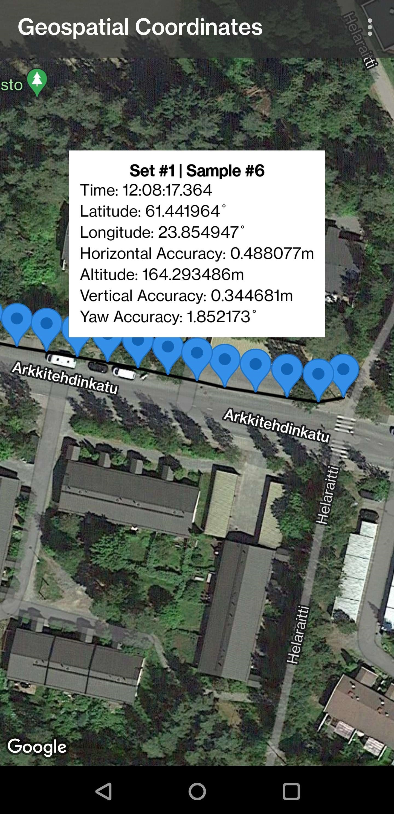 |

---

## Installation

To install the modified application to your Android device, you can follow the basic instructions below. The application utilizes [Google ARCore Geospatial API](https://developers.google.com/ar/develop/geospatial). You can see the list of supported devices [here](https://developers.google.com/ar/devices).

- Clone this repository.
- Download [Android Studio](https://developer.android.com/studio) and open the directory `original-repository/samples/geospatial_java` with it.
- To successfully run the application, you need an API key. More information can be found [here](https://developers.google.com/ar/develop/authorization?platform=android). Make sure you've enabled ARCore API and Maps SDK for Android for your API key in [Google Cloud Console](https://console.cloud.google.com).
- After you've got the API key, you need to create two new files inside the opened directory: `local.defaults.properties` and `secrets.properties`. The directory structure would look something like as follows:

```
.
├── .gradle
├── .idea
├── app
├── gradle
├── .gitignore
├── build.gradle
├── gradle.properties
├── gradlew
├── gradlew.bat
├── local.defaults.properties       # Create this...
├── local.properties
├── secrets.properties              # ...and also this file.
└── settings.gradle
```

Add the 2 following lines ***without changes*** to `local.defaults.properties`.

```
GEOSPATIAL_API_KEY = DEFAULT_API_KEY
MAPS_API_KEY = DEFAULT_API_KEY
```

Add the 2 following lines to `secrets.properties` and ***replace*** the `AIza...` with your own API key(s). You can set the same API key to both variables.

```
GEOSPATIAL_API_KEY = AIza...
MAPS_API_KEY = AIza...
```

- After these configurations, you can install the application to your device using e.g. USB or WIFI connection. See more detailed instructions [here](https://developer.android.com/studio/run/device.html).

---
